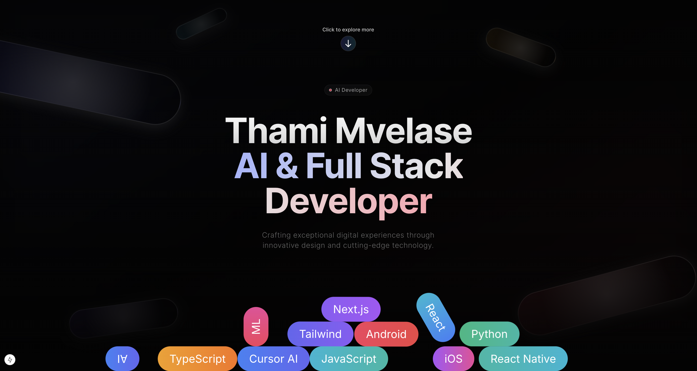

# Thami Mvelase | Portfolio 🚀

A modern, interactive portfolio website showcasing my skills as an AI and Full-Stack Developer.



## 🌟 Features

- ⚡ **Next.js 15** with App Router for optimized performance
- 🎨 **Tailwind CSS** for beautiful responsive design
- 🕹️ **Interactive Elements** including a Snake game with power-ups
- ✨ **Modern UI Effects** with particle animations and floating elements
- 🧠 **AI Integration** showcasing AI development expertise
- 🌓 **Dark Mode** optimized interface
- 📱 **Fully Responsive** design that works on all devices
- 🔍 **Type Safe** with TypeScript

## 🎮 Interactive Elements

- **Snake Game**: Play an engaging Snake game with power-ups and fun facts
- **Particle Effects**: Dynamic particle backgrounds and sparkle effects
- **Physics-based Animations**: Floating elements using Matter.js
- **Smooth Transitions**: Engaging animations with Framer Motion

## 💻 Tech Stack

- **Framework**: Next.js 15
- **Language**: TypeScript
- **Styling**: Tailwind CSS
- **Animation**: Framer Motion
- **Physics**: Matter.js
- **3D Graphics**: Three.js
- **Icons**: Heroicons
- **Particles**: tsParticles

## 🚀 Getting Started

### Prerequisites

- Node.js (version 18 or higher)
- npm or yarn

### Installation

1. **Clone the Repository**
   ```bash
   git clone https://github.com/thami33/portfolio.git
   ```

2. **Navigate to Project Directory**
   ```bash
   cd portfolio
   ```

3. **Install Dependencies**
   ```bash
   npm install
   # or
   yarn install
   ```

4. **Run Development Server**
   ```bash
   npm run dev
   # or
   yarn dev
   ```

5. **Open Your Browser**
   Visit [http://localhost:3000](http://localhost:3000) to see the portfolio.

## 📂 Project Structure

```
portfolio/
├── src/
│   ├── app/             # Next.js app router pages
│   ├── components/      # React components
│   │   └── ui/          # UI components
│   ├── lib/             # Utility libraries
│   ├── types/           # TypeScript type definitions
│   └── utils/           # Helper functions
├── public/              # Static assets
└── ...config files
```

## 🛠️ Development

This portfolio showcases a variety of modern web development techniques:

- **Advanced Animations** using Framer Motion
- **Physics Simulations** with Matter.js
- **Interactive Game Development**
- **Particle Effects** for engaging visuals
- **Responsive Design** principles for all screen sizes

## 📞 Contact

Feel free to reach out to me for collaboration or opportunities:

- **Email**: thamimvelase3@gmail.com
- **LinkedIn**: https://www.linkedin.com/in/thami-mvelase-2695b9100/
- **GitHub**: [https://github.com/thami33]

---

Built with ❤️ by Thami Mvelase
